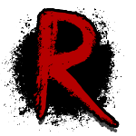

# Overview

> A Portfolio Markdown Rendering Template Built with Next.js.

<div style="display: flex; align-items: center; gap: 20px;">
   <a href="https://github.com/royce-mathew/r0yce">
      
   </a>
   
</div>

## Preview


This portfolio website leverages Next.js to serve MDX content in a flexible environment, supporting both static site generation and on-demand server rendering. The application tracks content for each page, including projects, blog posts, and other resources, using MDX files to store metadata and content.

## Installation

To install the project, follow these steps:

1. Clone the repository.
2. Install dependencies using your preferred package manager. For example:  
   • npm install  
   • pnpm install  
   • yarn install
3. Run the development server using the `dev` command.
4. To build the application for production, use the `build` command.

## Configuration

### Configuring Theming and SEO

To configure SEO and metadata, you can go to [`src/config/data.ts`](./src/config/data.ts) and modify the `config` object. This object contains properties like `name`, `roles`, `email`, for customization, and `seo` for SEO optimization.

You can change the the name, badge, and links for your github, linkedin and email from here.

You can also change the `theme` object in [`src/styles/globals.css`](./src/styles/globals.css) to customize the theme further.

### Configuring Home Page

For configuring the about me section, you can go to [`src/content/main/about.mdx`](./src/content/main/about.mdx) and modify the content there. This file contains the content for the about me section of the home page.

### Configuring Projects

For configuring the projects section, you can go to [`src/content/projects`](./src/content/projects) and modify the content there. This folder contains the content for the projects section of the home page.

## Commands

Common commands are defined in the `package.json` file. You can run these commands using your preferred package manager.

• `dev`: Runs Next.js in development mode.  
• `build`: Builds the application for production.  
• `start`: Runs the compiled production build.  
• `lint`: Runs ESLint to check for code issues.  
• `lint:fix`: Attempts to automatically fix lint issues.  
• `format`: Formats the code with Prettier.

## Development Environment

To set up the development environment, follow these steps:

1. Create a `.env.local` file in the root directory. Use the `.env.example` file as a template.
2. Create a Firebase project and enable Google and Github authentication.
3. Add your Firebase configuration to the `.env.local` file.
4. Add Google OAuth and Github OAuth credentials to the `.env.local` file.

### Commits

This project uses [Conventional Commits](https://www.conventionalcommits.org/en/v1.0.0/) for commit messages. You can use the `commit` command to create a commit message using the commitizen CLI.

It uses `husky` and `lint-staged` to run linting and formatting checks before committing changes.

## Content Organization

```python
./src/
├─ content/             # Markdown content
│ ├─ projects/          # Project pages in MDX format
│ │ └─ r0yce.mdx
│ └─ ...
└─ app/                 # Application components
   ├─ auth/             # Authentication
   │  └─ ...
   ├─ projects/         # Projects folder
   │  └─ [slug]/        # Slug for each project. Dynamically loads the MDX content for the project.
   └─ ...
```

## License

Licensed under the [GNU Affero General Public License v3.0](./LICENSE).
